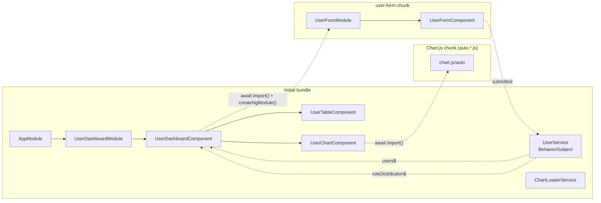
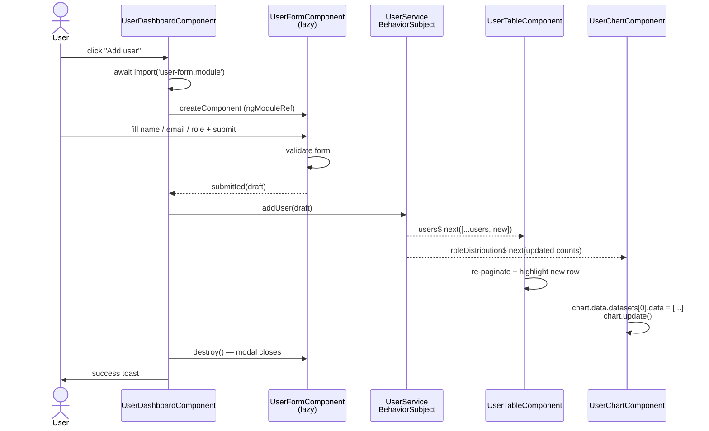

# Frontend Engineer Assessment — User Dashboard

An Angular 17 application that implements a user management dashboard with a
lazy-loaded form modal and a Chart.js pie chart, fully driven by an RxJS
`BehaviorSubject`.

## Quick start

```bash
npm install
npm start            # ng serve on http://localhost:4200
npm run build        # production build → dist/user-dashboard
npm test             # karma + jasmine (8 specs)
```

Tested with **Node 24** and **npm 11**. Angular CLI 17.3 is used (matches the
"Angular 14+" requirement).

## Stack

| Concern              | Choice                          |
| -------------------- | ------------------------------- |
| Framework            | Angular 17 (NgModule, AOT)      |
| State management     | RxJS 7 `BehaviorSubject`        |
| Charting             | Chart.js 4 (dynamic `import()`) |
| Forms                | `@angular/forms` reactive forms |
| Styling              | SCSS + CSS custom properties    |
| Lazy loading         | Dynamic `import()` + `createNgModule` |
| Change detection     | `OnPush` everywhere             |

## Project layout

```
src/app
├── app.module.ts                  # root – eagerly loads UserDashboardModule
├── app.component.{ts,html,scss}   # thin shell
│
├── core/
│   ├── models/user.model.ts       # User, UserRole, UserDraft, RoleDistribution
│   ├── services/
│   │   ├── user.service.ts        # BehaviorSubject<User[]> + roleDistribution$
│   │   └── chart-loader.service.ts# lazy-loads Chart.js (cached)
│   └── types/chart.types.ts       # minimal Chart.js surface types
│
├── shared/
│   ├── shared.module.ts
│   └── loading-spinner/           # reusable spinner (inline + overlay variants)
│
├── features/
│   ├── user-dashboard/            # EAGERLY loaded
│   │   ├── user-dashboard.module.ts
│   │   ├── user-dashboard.component.{ts,html,scss}
│   │   └── components/
│   │       ├── user-chart/        # owns the canvas + chart instance
│   │       └── user-table/        # owns search, role filter, pagination
│   │
│   └── user-form/                 # LAZY-LOADED (separate webpack chunk)
│       ├── user-form.module.ts    # imports ReactiveFormsModule
│       └── user-form.component.{ts,html,scss}
│
└── styles.scss                    # design tokens (#1c4980, #383838, 48px)
```

## How each requirement maps to code

| Requirement | Implementation |
| --- | --- |
| Table of users (Name / Email / Role) | `user-table.component.html` |
| Chart.js pie chart of role distribution | `user-chart.component.ts` |
| **Add User** button opens a lazy-loaded modal | `UserDashboardComponent.openAddUserModal()` uses `await import('../user-form/user-form.module')` + `createNgModule()` + `ViewContainerRef.createComponent()` |
| Chart.js loaded **dynamically on init** | `ChartLoaderService.load()` → `import('chart.js/auto')` |
| Lazy loading "via Angular's module system" | `UserFormModule` is never imported statically — only the dynamic `import()` reaches it, so webpack splits it into its own chunk (`user-form-module.[hash].js`) |
| Reactive form with validation (Name / Email / Role) | `UserFormComponent` uses `FormBuilder` with `Validators.required`, `Validators.email`, custom `noWhitespace` and `roleValidator` |
| Emit submitted user to parent + close modal | `@Output() submitted` / `@Output() closed` — host destroys the dynamically-created component on either |
| State via `BehaviorSubject` | `UserService._users$ = new BehaviorSubject<User[]>(...)` seeded with five users; exposed as `users$` and derived `roleDistribution$` |
| Subscription updates table + chart in real time | Dashboard template uses the `async` pipe; the chart updates its dataset in place and calls `chart.update()` |
| Design theme `#383838`, `#1c4980` | `styles.scss` CSS variables `--color-neutral` / `--color-primary` |
| Buttons + inputs 48px tall | `--control-height: 48px` applied to `.btn`, `.input`, `.select` |
| No console errors or warnings | Verified by `ng build --configuration=production` (0 warnings) and a headless Chrome smoke test |
| **Bonus** – pagination + filtering | Page-size selector, page navigation with elision, search-by-name/email/role, role filter |
| **Bonus** – loading indicators + transitions | Spinner inside chart card while Chart.js chunk loads; spinner on "Add user" button while form chunk loads; spinner on submit; fade-in row highlight for newly added users; modal rise-in + backdrop fade animations; success toast after add |

## Lazy-loading evidence

Production build output (`ng build`):

```
Initial chunk files   | Names            |  Raw size | Estimated transfer size
chunk-MYHV7F32.js     | -                | 180.37 kB |  47.91 kB
main-B5D6RMFR.js      | main             | 173.95 kB |  43.13 kB
polyfills-FFHMD2TL.js | polyfills        |  33.71 kB |  11.02 kB
styles-QH534VBJ.css   | styles           |   3.44 kB |   1.06 kB

                      | Initial total    | 392.29 kB | 103.93 kB

Lazy chunk files      | Names            |  Raw size | Estimated transfer size
chunk-BXTCDBUI.js     | auto             | 200.45 kB |  59.94 kB   ← Chart.js
chunk-XKW36IJI.js     | user-form-module |   8.62 kB |   2.68 kB   ← UserFormModule
```

* `auto` is the Chart.js chunk — fetched only when `UserChartComponent` mounts.
* `user-form-module` is the form chunk — fetched only when the user clicks **Add user**.

You can confirm this in any browser:
1. Open DevTools → Network → JS, refresh, observe only the initial bundles are
   loaded plus the Chart.js chunk (it loads on dashboard mount).
2. Click **Add user** → the `user-form-module.*.js` request appears on demand.

## Architecture diagram



## Data flow when adding a user



## Accessibility & UX touches

* All controls reach 48px target height (per spec).
* Modal uses `role="dialog"` + `aria-modal="true"` + `aria-labelledby`; closes
  on Esc, backdrop click, or X button.
* Live region (`role="status"`) announces newly added users.
* Tables use `<th scope="col">` and a polite empty-state message.
* Pie chart wraps the canvas with `aria-label` for screen readers.
* Color choices preserve WCAG AA contrast.

## Browser support

Angular 17 default — evergreen browsers (last 2 versions of Chrome, Edge,
Firefox, Safari).

## Scripts

| Script        | Purpose                              |
| ------------- | ------------------------------------ |
| `npm start`   | `ng serve` on `http://localhost:4200`|
| `npm run build` | Production build with AOT          |
| `npm run watch` | Development build with watch mode  |
| `npm test`    | Karma + Jasmine unit tests           |


